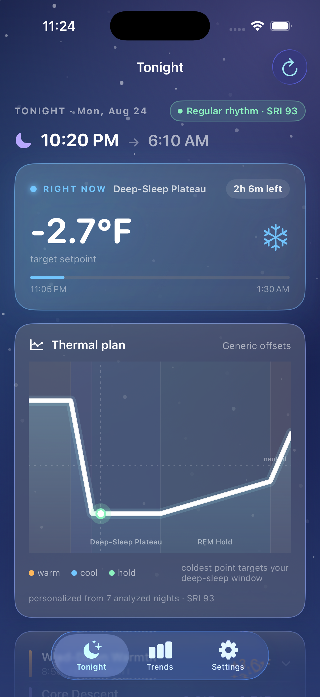
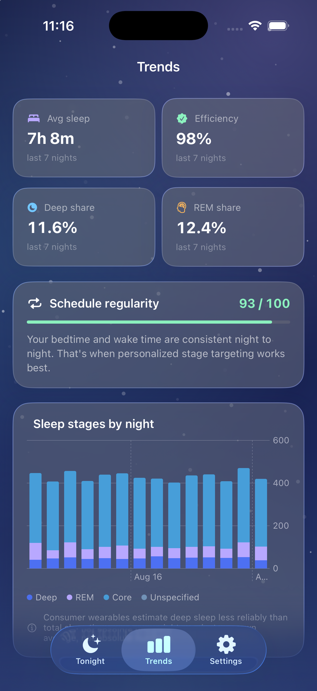
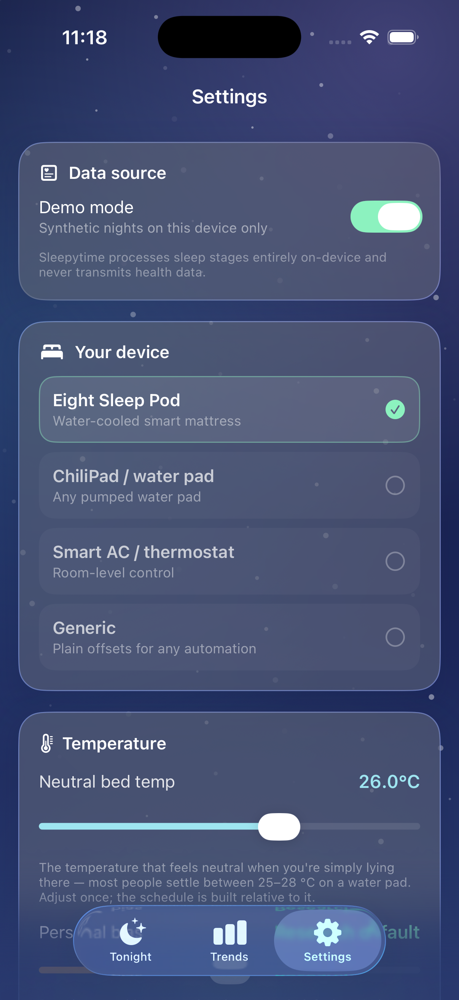

# Goodnight

<p align="center">
  
  
  
</p>

**Eight Sleep–style dynamic bed-temperature scheduling, computed entirely on your iPhone from the sleep data you already have.**

Goodnight reads your nightly sleep stages (deep / REM / core / awake) from Apple Health, learns your personal sleep architecture and schedule consistency, and generates a phased overnight temperature schedule: warm wind-down, cool plateau through *your* deep-sleep window, stable REM hold, gentle wake ramp. Export the timed setpoints and paste them into Apple Shortcuts, your Eight Sleep, ChiliPad/Dock Pro, or a smart-AC automation.

No accounts. No servers. No analytics. Health data never leaves the device.

## The science (verified against primary sources)

| Phase | Setpoint | Evidence |
|---|---|---|
| Wind-down (T−90 min → lights-out) | neutral **+1.5 °C** | Distal vasodilation drives the core-temp drop that initiates sleep — Kräuchi 2000 *AJP*; warm baths cut sleep latency ~36% — Haghayegh 2019 *Sleep Med Rev* |
| Core descent (lights-out → +45 min) | lerp +1.5 → −3 °C | Steepest core decline supports cycle-1 sleep — Campbell & Broughton 1994; first-half heat is the most damaging window — Okamoto-Mizuno 2012 |
| Deep-sleep plateau (→ personal SWS window end) | neutral **−3 °C** (2–4 °C bounded) | Conductive-cooling RCT: +7.5 min N3, HR −2.4 bpm — Herberger 2024 *Sci Rep*; cool early-phase: +22% deep (men), +25% REM (women) — Moyen 2024 *Bioengineering* |
| REM hold (→ wake −45 min) | stay cool at **−0.7 × cool depth** | Cool REM ↑ REM% & ↓ latency — Kim 2025 *Healthcare*; not near-neutral folklore |
| Wake ramp (final 45 min, opt-out) | rise to neutral **+1 °C** | Kim 2025 pre-wake warm; mirrors dawn-light physiology; disabled in hot-sleeper mode |

**Personalization:** timing medians prefer high-efficiency nights (SE ≥ 85); the plateau's end is anchored to *your* deep-sleep centroid, REM-cycle period, or reconstructed ultradian deep window (`0.55^i` / `1.55^i` cycle weights from [Sleep Optimizer](https://github.com/VanshJP/sleep-optimizer)); magnitude adapts to your rolling 7-night deep/REM shares vs. your own baseline; women's setpoints start ~1 °C warmer (Moyen 2024); and the **Sleep Regularity Index** gates it all: below SRI 65 the architecture is too unstable to personalize.

**Also new:** schedule confidence meter, morning thermal debrief (stage × commanded temp correlation), gradual ~2.5 °F export steps for manual pads, instant cold-start from cached schedule (Health refreshes in the background).

Full synthesis with all citations and flagged conflicts: [`docs/RESEARCH.md`](docs/RESEARCH.md) · Algorithm spec + pipeline graph: [`docs/ALGORITHM.md`](docs/ALGORITHM.md)

## Beyond the schedule

- **Adaptive learning** — an on-device hill-climb tunes cool depth from your own multi-night outcomes (adherence-gated; see ALGORITHM.md)
- **Widget + Live Activity** — home-screen widget shows the current phase; a Live Activity with Dynamic Island countdown auto-runs during the sleep window
- **App Intents** — "Next bed setpoint" and "Tonight's bed plan" work from Shortcuts or Siri
- **Background refresh** — HealthKit background delivery updates the plan after each sleep
- **Dual zone** — independent Side A / Side B schedules for two sleepers
- **Reminders** — opt-in local notification 15 minutes before wind-down

## Project layout

```
SleepCore/                  SwiftPM package — pure, deterministic engine
  Sources/SleepCore/
    NightBuilder.swift      session merge, source arbitration, night grouping, nap filter
    Features.swift          per-night metrics (TST, SE, WASO, deep centroid, cycle period)
    Regularity.swift        Sleep Regularity Index (5-min bins, 24 h clock)
    Learning.swift          adherence-gated hill-climb over cool depth
    ProfileBuilder.swift    rolling windows, personal baselines, medians
    ScheduleEngine.swift    phase construction + bounded personalization rules
    Export.swift            device mapping + automation text/CSV export
  Tests/SleepCoreTests/     66+ tests: hand-computed fixtures, SRI math, schedule-shape
                            invariants, cycle architecture, rule triggers + bounds, DST, property fuzz
sleepytime/                 SwiftUI app (iOS 26)
  Services/HealthKitService.swift   actor; async descriptors, tz metadata, observer
  Services/DemoData.swift   seeded synthetic nights (demo mode)
  App/AppModel.swift        @Observable state, persisted setup, async Health refresh
  Intents/                  App Intents for Shortcuts/Siri
  Views/                    Tonight (debrief + confidence), Trends, Settings, privacy, export
Widget/                     WidgetKit extension + Live Activity (Dynamic Island)
Shared/                     app-group snapshot store + ActivityAttributes
docs/                       RESEARCH.md · ALGORITHM.md (with mermaid pipeline)
```

## Run it

```bash
open sleepytime.xcodeproj        # Xcode 26.x, iOS 26 simulator or device
# Engine tests (no simulator needed):
xcrun swift test --package-path SleepCore
# App build:
xcodebuild -scheme sleepytime -destination 'generic/platform=iOS Simulator' build
```

- **Simulator / no HealthKit data:** enable *Settings → Demo mode* (or launch with `-sleepytime-demo`); tab selection via `-sleepytime-tab-trends`, units via `-sleepytime-fahrenheit`.
- **Real data:** run on a device with Apple Watch sleep history, tap *Connect Apple Health*, grant read access. Sleep stages require watchOS 9+ / iOS 16+ sources.
- **Widget data on simulator:** Xcode strips app-group entitlements from ad-hoc simulator builds, so the widget shows its empty state there. On a device build with your team's signing (which auto-registers the `group.com.vansh.sleepytime` app group) the widget populates.
- Regenerate the Xcode project after adding files: `xcodegen generate` (see `project.yml`).

## Privacy

- HealthKit read-only (`sleepAnalysis`), processed in-memory on device; only derived aggregates persist locally, nothing transmits.
- `PrivacyInfo.xcprivacy` declares **zero collected data types**.
- Not medical advice — temperature effects in trials are real but modest (~10–15 min stage shifts). If you suspect a sleep disorder, talk to a clinician.

## License

MIT — see [LICENSE](LICENSE).
