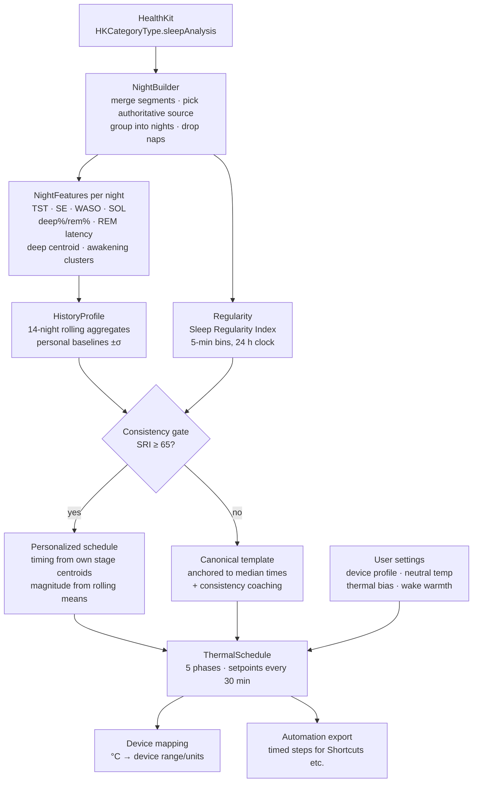

# Goodnight — Algorithm Specification

The engine (`SleepCore` package) is a deterministic, side-effect-free pipeline. It reads sleep-stage intervals that already exist on the phone (HealthKit), never collects anything, and emits a phased temperature schedule the user can apply to any thermal device (Eight Sleep, ChiliPad/Dock Pro, smart AC/thermostat) via automations.

## Pipeline

## Inputs

`Night` = chronologically ordered `Segment(start, end, stage)` where stage ∈ {awake, core, deep, rem, unspecified}.

**Night grouping** — sessions merged with ≤120 min gap tolerance; night key = calendar date of `sessionStart − 6 h`; sessions <3 h starting 08:00–18:00 are naps and excluded; multiple sessions on one key merge into one timeline.

## Per-night features

| Feature | Definition |
|---|---|
| onset / offset | first asleep moment / end of last asleep interval |
| TST | Σ asleep time |
| TIB | offset − sessionStart |
| SE | TST / TIB |
| SOL | onset − sessionStart |
| WASO | Σ awake time strictly inside [onset, offset] |
| deep%, rem% | stage minutes ÷ TST |
| REM latency | first REM start − onset |
| **deep centroid** | duration-weighted mean clock time of deep epochs, in minutes after onset |
| deep front ratio | deep minutes in first half ÷ total deep |
| midsleep | (onset+offset)/2 |
| awakening clusters | awake intervals ≥5 min inside [onset, offset] |

## Cross-night profile (trailing window, default 14 nights)

- Rolling means over last ≤7 *detailed* nights: deepPct, remPct, SE, SOL, TST; personal SDs.
- **SRI**: 24-h clock from noon, 5-min bins, state = asleep iff bin center ∈ any asleep interval of an included night. SRI = mean agreement between all consecutive-day pairs × 100. One fixed pipeline; used within-person only.
- Consistency class: high ≥80, moderate 65–79.9, low <65.

## Schedule generation

Anchors: lights-out **L** (target bedtime; default median onset −15 min) and wake **Wt** (default median offset). All temps are °C offsets from the user's **neutral** (default 26 °C ≈ Moyen 2024 medians).

| Phase | Window | Default | Evidence |
|---|---|---|---|
| WindDown | [L−90m, L) | neutral **+1.5** | bath analog (Haghayegh 2019); Raymann 2008 +0.4 °C skin |
| Descent | [L, L+45m) | lerp +1.5 → −coolDepth | MROD ~60 min pre-onset (Campbell & Broughton 1994); first-half heat is the enemy (Okamoto-Mizuno 2012) |
| CoolPlateau | [L+45m, SWSend) | neutral **−coolDepth** (default 3.0) | Herberger 2024 (+7.5 min N3); Moyen 2024 (+22 % deep men, +25 % REM women) |
| REMHold | [SWSend, Wt−45m) | drift to neutral **−0.5** | REM poikilothermy (Cerri 2017): stability beats manipulation |
| WakeRamp | [Wt−45m, Wt] | rise to neutral **+1.0** | adjudicated gentle default; Kräuchi 2004; opt-out |

`SWSend = L + clamp(1.6 × deepCentroid, 120, 300) min`, default L+210 min when no usable deep data (cycles 1–2 heuristic).

### Personalization rules (each bounded, order-independent)

| Rule | Trigger | Effect | Bound |
|---|---|---|---|
| R1 long latency | mean SOL > 25 min | windDown → 120 m, descent ramp → 60 m | cap |
| R2 deep deficit | mean deep% < baseline − 0.5 σ (≥5 detailed nights) | coolDepth +0.5, plateau +20 m | coolDepth ≤ 4.0, plateau end ≤ 300 m |
| R3 early awakenings | ≥2 awakenings ≥5 m inside plateau across recent nights | coolDepth −0.5 | coolDepth ≥ 2.0 |
| R4 REM deficit | mean rem% < baseline − 0.5 σ | REMHold floor → neutral | — |
| R5 sex prior | female (HealthKit) | all cooling magnitudes ×(−1 °C gentler), windDown +0.5 warmer | — |
| R6 thermal bias | user slider ±1 | adds bias×1.5 °C to every setpoint | device clamp |
| R7 consistency gate | SRI < 65 | disable R2–R4 (architecture unreliable when timing shifts nightly), emit coaching note | — |

| R8 homeostatic pressure | prior night TST < 6.5 h | coolDepth +0.25, plateau +15 min (slow-wave rebound) | coolDepth ≤ 4.0 |

### Adaptive learning (closed loop)

`AdaptiveLearning` runs a 1-D hill-climb over cool depth, entirely on-device:

1. **Adherence** — a night counts if onset lands within ±45 min of schedule lights-out (clock-time comparison) and TST ≥ 5 h.
2. **Trial** — 5 consecutive adherent nights at the current candidate depth.
3. **Score** — mean trial deep% vs. your own prior-period baseline: > +0.8 pp = keep stepping the same direction (+0.25 °C), < −0.8 pp = reverse, else hold. Candidate clamped to [2, 4] °C.
4. The engine consumes the candidate via `ThermalSettings.adaptiveCoolDepthC`; rule deltas still apply on top, bounded.

### Cycle-aware SWS window

Per-night median gap between REM-episode onsets estimates the cycle period (45–180 min filter). When recent nights yield a period, the plateau ends at **2.2 × cycle period** after lights-out; otherwise the deep-centroid heuristic (1.6 × centroid) applies.

### Wake ramp vs. predicted Tmin

The ramp never starts before predicted core-temperature minimum (wake − 3.5 h female / − 2 h male / − 2.75 h unknown; Park 2013), so warming never fights the nocturnal core drop.

### Travel mode

Sleep samples carry `HKMetadataKeyTimeZone`; nights are keyed in their local zone. When recent nights span multiple zones, medians use the dominant zone and the engine notes that anchors follow the most recent local schedule.

Hot-sleeper mode: disables WakeRamp (holds REM floor).

### Device mapping

- Water pads (Eight Sleep/Chilipad): clamp 13–43 °C, absolute setpoints.
- AC/thermostat: deltas clamp ±2 °C around the user's normal room setpoint; WindDown becomes no-op (can't heat a bed).
- Generic: raw offsets.

## Outputs

`ThermalSchedule { lightsOut, wake, phases[], sampledSetpoints (30-min grid + boundaries), metricsUsed[], notes[] }` plus automation text export ("10:15 PM — set pad to 24 °C" style) for Shortcuts/whatever system the user owns.

## Test strategy

Pure functions + fixture hypnograms. Suites cover: feature math vs hand-computed values; night grouping (post-midnight onset, naps, fragmentation); source arbitration; SRI against hand-built bin fixtures (identical nights → 100, degraded cases ordered correctly); schedule shape invariants (windDown warmest, plateau coldest, monotone descent, REMHold ≥ plateau, ramp rises, clamping, determinism); every personalization rule triggers and respects bounds; edge cases (empty history, single night, unspecified-only stages, shift-worker daytime main sleep).
